# 实现自动化办公
在日常办公，会经常遇到批量修改文件名或者按照颜色分类颜色文件的情况，花费很多时间，也会消耗精力，于是决定开发此程序
## 运行之前的操作
打开想放置此代码的文件夹，例如D盘,那就打开D盘，鼠标右键，选择在终端中打开，然后输入以下命令，如图

    <a href="./">
        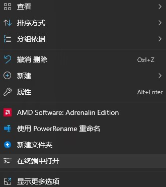
    </a>

若在线上代码仓库gitee上看到此开源代码，需要先将代码克隆到本地。在命令行终端上输入

    git clone https://gitee.com/iven_he/office-automation.git
进入代码文件夹

    cd D:\office-automation
建议创建虚拟环境，防止污染全局python

    python -m venv .venv
安装代码依赖库

    pip install -r requirements.txt -i https://pypi.tuna.tsinghua.edu.cn/simple
## 对工作文件夹的要求
此项目需要一个工作文件夹，包含了已经初步完成的800x1200尺寸的平铺图，命名规则：1200(x)。x是编号，应该从6开始;对于模特图，应该是以数字命名：例如1,2,3等。但是其他数字似乎没有影响。

一个标准的工作文件夹应该如下图所示

    <a href="./">
        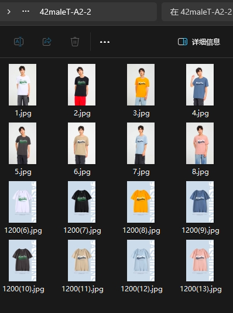
    </a>

若是对于童装的多件套装，标准的工作文件夹应该如下图所示

    <a href="./">
        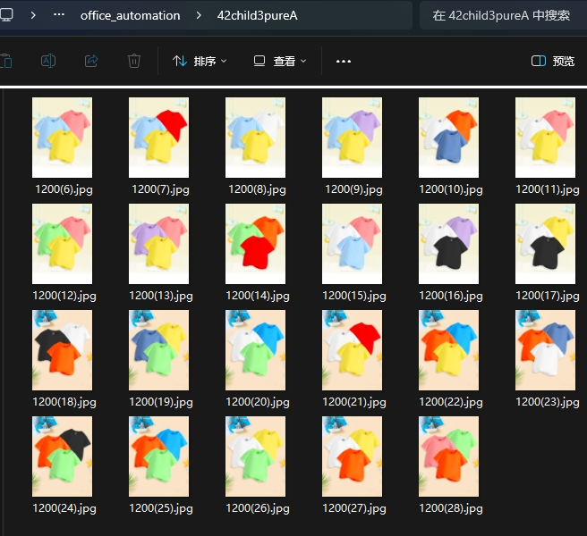
    </a>

## 自动化办公的初始化
首先要先进行颜色阈值的初始化——`color_div/init.py`
### init简介
init.py是一个颜色阈值初始化程序，用于初始化颜色阈值，使得在后续的颜色识别中能够更加准确的识别颜色。传入的参数是包含所有文件夹路径。\
在终端打开的文件夹会作为相对路径的根目录，保存的颜色阈值文件会保存在改目录下的下，建议每个工作文件夹都作为单独的项目，例如童装和成人应该分别初始化

### 使用方法
**建议直接讲图片保存在office-automation文件夹下，下面的指令都是讲工作文件夹放在office-automation下进行操作的**\
然后鼠标右键，在终端打开office-automation文件夹
如下图

    <a href="./">
        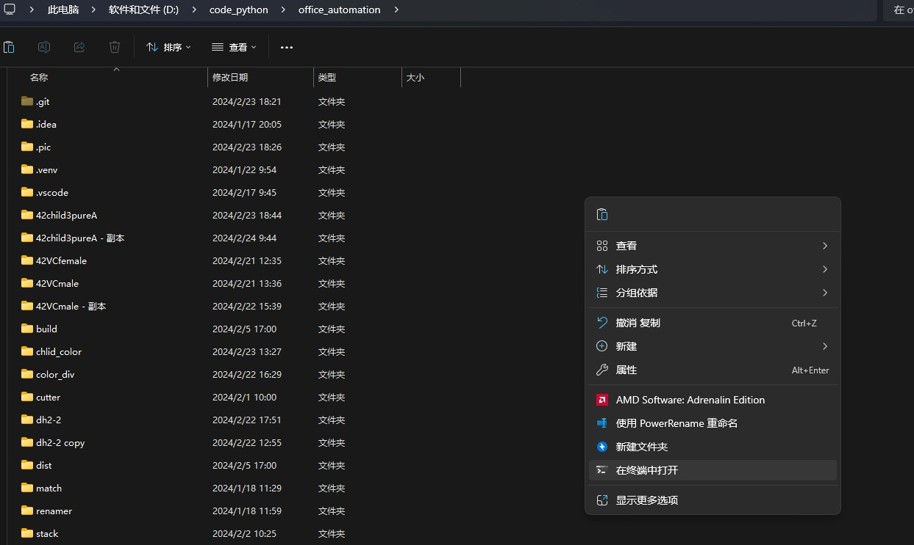
    </a>

然后激活环境

    .\.venv\Scripts\activate
然后使用cd指令进入工作文件夹中，例如

    cd 42child3pureA
此时，终端显示应该是这样的

    (.venv) (base) PS D:\code_python\office_automation\42child3pureA>
如图

    <a href="./">
        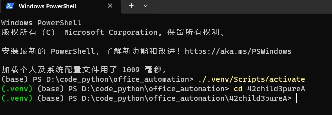
    </a>

运行init.py
(PATH->init.py是指init.py的路径)，例如：

`D:\code_python\office_automation\color_div\init.py`

    # 在命令结尾的-p(也可以是--path)是初始化图片的路径文件夹的参数
    python PATH->init.py -p D:\AM66

    # 或者
    python PATH->init.py --path D:\AM66
如图

    <a href="./">
        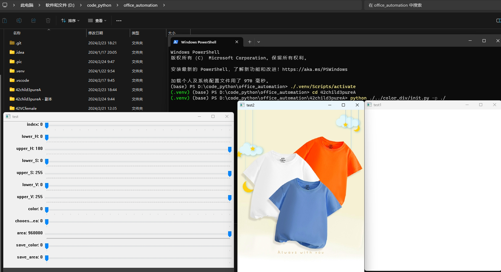
    </a>

**注意：**\
图中的`./`是指`D:\code_python\office_automation\42child3pureA`下的根目录，即`D:\code_python\office_automation\42child3pureA`

### 运行init窗口

- 运行程序后会出现3个窗口，一个窗口调整阈值滑块，一个窗口显示原图片，一个窗口显示识别后的图片

    <a href="./">
        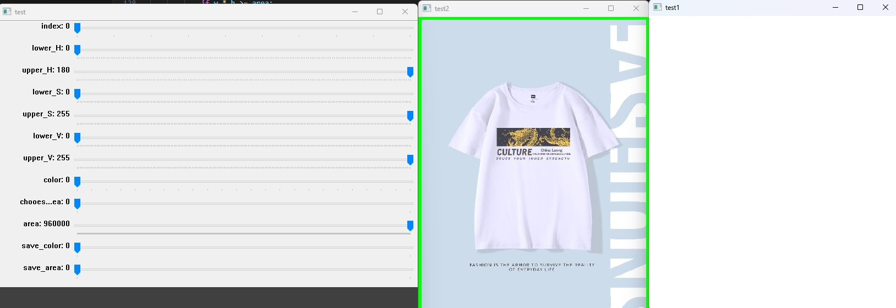
    </a>

- 先调整index滑块，使得显示的图片是需要识别的图片

- 滑动阈值滑块，调整HSV颜色阈值，使在尽可能小的阈值范围将衣服尽可能多的显示白色

- 调整area滑块，用尽可能大的值使得显示原图像的窗口出现完整的绿色框框住衣服
如图

    <a href="./">
        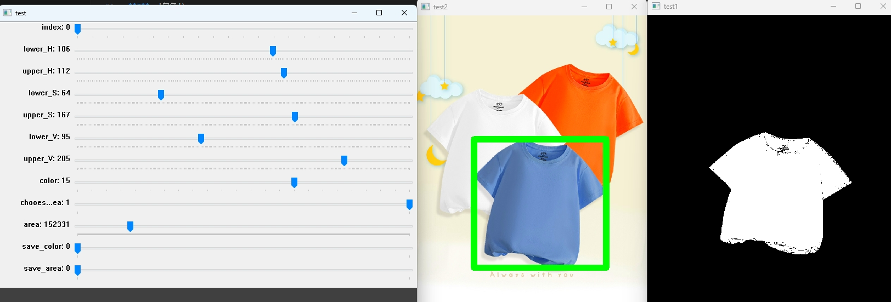
    </a>

- 调整chooes_area滑块，0对应模特的识别面积，1对应平铺图的识别面积

- 阈值调整完毕后再次滑动index滑块，确定阈值调整的效果，不会识别到别的颜色，如果效果不佳，反复调整阈值

- 选择color对应的数字：

**0** :'白色'\
**1**:'黑色'\
**2**:'浅紫'\
**3**:'粉红'\
**4**:'浅蓝'\
**5**:'浅绿'\
**6**:'杏色'\
**7**:'浅黄'\
**8**:'红色'\
**9**:'黄色'\
**10**:'深灰'\
**11**:'卡其'\
**12**:'虾玉色'\
**13**:'雾霾蓝'\
**14**:'天蓝'\
**15**:'水蓝'\
**16**:'橙色'\
**17**:'克莱因蓝'\
**18**:'草绿'\
**19**:'紫色'\
**20**:'彩兰'\
**21**:'啡色'\
**22**:'花灰'\
**23**:'灰蓝'

- 滑动两个save滑块完成保存操作，然后一定要把save滑块归零，然后调整index设置其他颜色的阈值
完成初始化后，文件夹的结构应该是这样的

    <a href="./">
        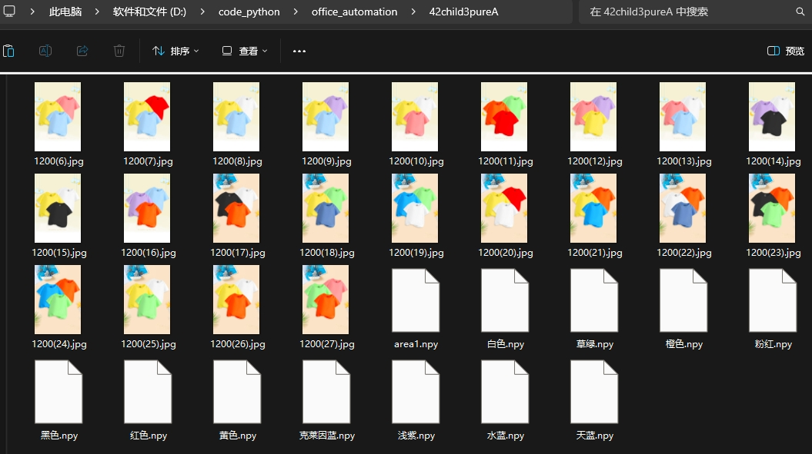
    </a>

或

    <a href="./">
        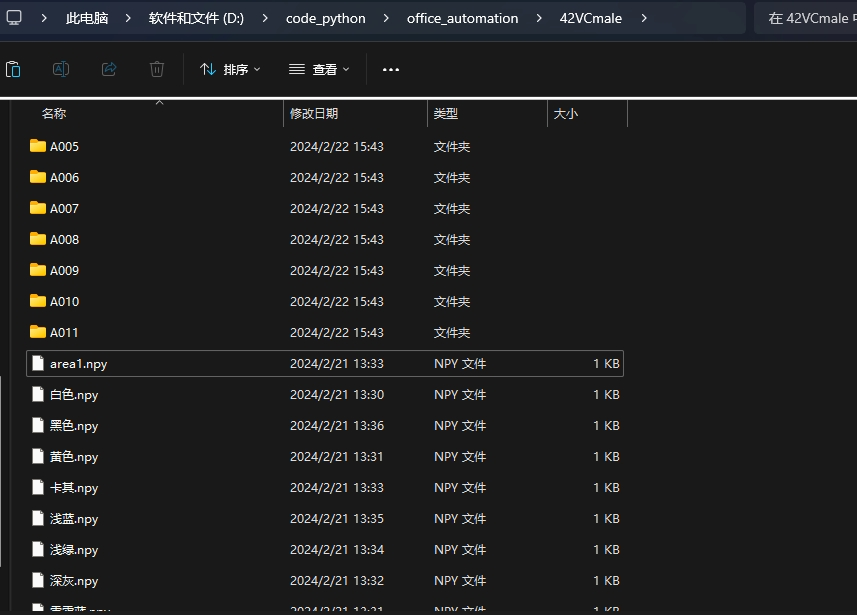
    </a>

__! 注意，每个面积保存一次后，理论上来说不需要再调整 !__

## 主文件使用方法

**备份工作文件夹，以防出现意外**

以上图的工作文件夹为例，程序会对所有图片进行裁剪和分类\
在终端执行命令(需要激活虚拟环境)
    
然后使用cd指令进入工作文件夹中，如果已经进入，不必理会，例如

    cd 42child3pureA

激活虚拟环境，如果已经激活，不必理会

    .\.venv\Scripts\activate
此时，终端显示应该是这样的

    (.venv) (base) PS D:\code_python\office_automation\42child3pureA>

__运行程序，无需粘贴png图片(默认)，没有多颜色分类(多件童装的形式)(默认)，没有提供额外的主图文件夹(默认)，需要颜色分类，代码实例如下__

    python officeautomation.py --path D:\42maleT-A2-2

__运行程序，无需粘贴png图片(默认)，没有多颜色分类(多件童装的形式)(默认)，没有提供额外的主图文件夹(默认)，不需要需要颜色分类，代码实例如下__

    python officeautomation.py --path D:\42maleT-A2-2 --ifcolordiv False
对于多颜色童装例如下图的情况

    

一般需要粘贴png图片

以下是多颜色的童装并且需要粘贴png的代码实例

    python path->office_automation.py --path D:\KC-33-171009\AM66 --morecolor true --stack true --stack_path path->png --xposition 90 --yposition 760
如图

    <a href="./">
        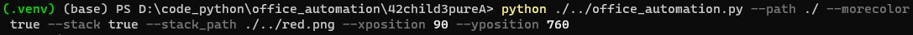
    </a>

以上指令\
参数`--xposition`是png的粘贴x轴(横向)位置\
参数`--yposition`是png的粘贴y轴(纵向)位置\
参数`--path`是图片所在的路径\
参数`--morecolor`是指是(true)否(false)是多颜色识别\
参数`--stack`是指是(true)否(false)是粘贴png图片\
参数`--stack_path`是指png图片的路径\
`path->office_autmation.py`是office_automation.py的路径，`path->png`同理

运行后会弹出一个粘贴png的预览窗口，如果预览结果比较满意，按任意键可以继续运行代码
## 如果png粘贴位置不理想的处理方法
若出现png粘贴位置不合预期，将窗口切回终端，按ctrl+C，然后关掉窗口，强行终止程序，然后按`上箭头`键重复上一次运行的命令，调整`--xposition`和`--yposition`参数的值，然后回车运行

## 历史版本
### 2.1版本新增功能：
 - 添加了多颜色识别的功能，对于三颜色童装和双颜色通知提供了多颜色分类，在main函数的调用将morecolor参数改为True即可

### 2.2版本新增功能：
 - 添加了png图片的粘贴
 - 对于多件套装的童装需要粘贴png图片（两件装等），在main函数封装了stack参数，如果需要粘贴，将stack参数改为True,stack_path改为png的路径，position改为粘贴的位置坐标。

### 3.0版本新增：
修改为命令行传参形式

### 3.1版本新增：
 - 添加新的颜色
 - 随机将两张主图的800x800尺寸的图片移动到项目根目录下，并且改名为主题(n).jpg
 - 对于含有中文路径的图片不进行图像识别操作

## 帮助
- 如果对参数不清楚，可以输入以下命令查看帮助

    python officeautomation.py -h
- `/`是指相对路径，`\`是指绝对路径，参考[绝对路径和相对路径的区别](https://www.bilibili.com/video/BV1ca411x7rZ/?spm_id_from=333.337.search-card.all.click&vd_source=d772b0d0c57066cbcdbd41488839480f)

## 如何添加新颜色
**此操作需要修改源代码**
### 修改init.py文件
- 第63行修改第四个参数，这个数字是指 `颜色的总数-1`，例如现在有24种颜色，那么这个数字应该是23

        cv2.createTrackbar('color', 'test', 0, 23, callback)
- 第33行的dist是一个字典，添加新的颜色，`编号:颜色名`
### 修改color_divider.py文件
- 第53行是需要创建的颜色文件夹的列表，在内添加新的颜色，如果这个颜色不添加，这个文件夹就不会创建，移动文件的时候文件就会丢失
- 如果这个颜色是需要单颜色的识别，即成人的一件装，在代码128行开始的`# region 单件装颜色识别`的区域到170行的`# endregion`的区域添加新的颜色的识别代码，格式如下

        elif color_detect(img, '颜色名.npy', areafile=area):
            mvfile([i], os.path.join(path, '颜色名'))
- 如果这个颜色是需要多颜色的识别，即童装的多件装，在代码188行开始的`# region 对于童装套装的颜色识别`的区域到202行的`# endregion`的区域添加新的颜色的识别代码，格式如下

        if color_detect(img, '颜色名.npy', areafile=area) and len(dict_[file_path]) < 3:
            dict_[file_path].append('颜色名')

## 需要优化的部分：
事后再P尺寸1200的主图模特图，直接存在主图文件夹。然后打开cutter/cut.py在结尾函数调用的位置调整参数，比如有多个图片(A和B)都在主图路径(D:\41short\KC-41-XOU179\主图)下，并且A和B都是主图模特图，需要进行裁剪

    cut_cut('B.jpg','A.jpg',path=r'D:\41short\KC-41-XOU179\主图')

运行文件

## 额外的功能
对于设计人员，有很多的图片在本地难以寻找，但是又有相似的图片，这个图片可能是原图片的缩放版本，现在想知道原图片的位置

    打开match/matcher.py，调整结尾的函数参数，第一个参数是原图片可能会存在的文件夹路径，第二个参数是需要寻找的图片的路径(现有图片)

    main('D:\\', 'C:\\user\\desktop\\1.png')

## 尚未开放完毕的功能
在许多设计公司，印花的图片可能存在共享网络的电脑上，现有需求，本地用户直接在共享网络文件中查找图片路径

    match/test.py文件是在测试在局域网共享网络中连接其他主机的共享文件夹，然后尝试在内读取图片文件

    现有难点：
        1.无法获取目标计算机文件下下的文件路径，只能获取文件夹的名次，若有在共享文件夹中有os.walk类似的方法似乎可以解决这个问题
        2.无法使用OpenCV的decode方法打开目标文件夹下的图片